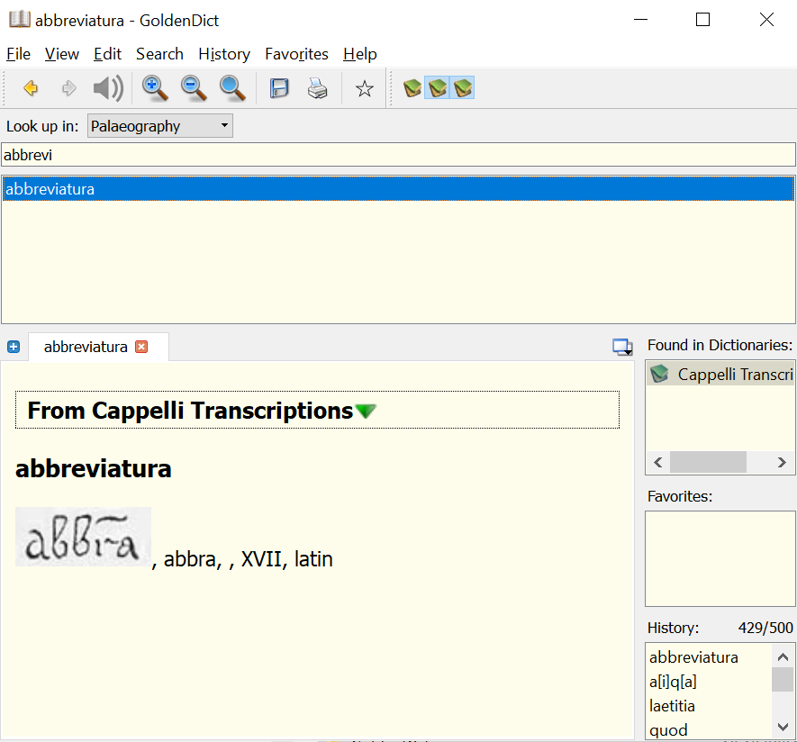

# Cappelli as StarDict
## 🧐 What is this?
A conversion of Adriano Cappelli's Lexicon Abbreviaturarum (A dictionary of Latin Abbreviations) into StarDict format that can be used in a broad variety of dictionary lookup programs. 

## 🧪 Original Source of data
This conversion is based on the transcription of [Cappelli's dictionary](https://www.adfontes.uzh.ch/en/ressourcen/abkuerzungen/cappelli-online) done by a crowdsourcing team and expert reviewers of the University of Zürich. Without their work and the fact that they provide all their data for [download](https://www.adfontes.uzh.ch/en/ressourcen/abkuerzungen/cappelli-daten-zum-download) and free use, I would be never able to do this little conversion. 

## 👨‍💻 Installation
First, you need a dictionary lookup program that supports StarDict format of dictionaries. I recommend [GoldenDict](http://goldendict.org/). You can also use GoldenDict as a portable app, if you cannot instal it. 

Second, download cappelli.zip and unzip it into the folder where you store dictionaries. In GoldenDict, it is usally a **content** folder within its main directory. 

Third, start GoldenDict. In the first start, it should index Cappelli and then you can configure dictionaries. Go to "Edit" -> "Dictionaries". A window will be displayed with three tabs: "Sources", "Dictionaries" and "Groups". Select "Groups" and make sure that Cappelli is at least in one group presented there. Use ">" button to add a dictionary to a group. 

## ❗ Nota bene
Cappelli is divided into 2 dictionaries:
- Cappelli abbreviations - sorted by abbrevitiations as a standard Cappelli
- Cappelli transcriptions - sortedy by expanded words - so you can, e.g., see all possible abbreviations for a word "Quod"
You can activate just one of these or both. 

## 🐛 Bugs
This is a work in progress so it is definitely possible that there are some bugs. 

## 🎁 Support  
If you wish to support my work on this StarDict conversion and other silly stuff, you can make a [PayPal donation](
https://www.paypal.com/cgi-bin/webscr?cmd=_s-xclick&hosted_button_id=6AMGMUDRX29XU&source=url). 🤸‍♂️

## 📯 Where to follow me? 
You can follow me on [Twitter](https://twitter.com/CatoMinor3), if you want :).

-- Jan Odstrcilik

